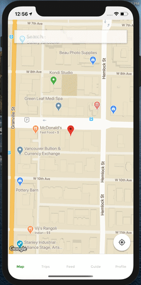

# OCRBC

Happy Camper is a cross platform mobile application created as a better alternative to existing options available today for camping reservations in British Columbia.

## Screenshots





## Installation

## Server

```bash
yarn install
```

## Client

```bash
yarn install
cd ios
pod install
```

## Run - (./client)

```bash
yarn ios
```

## Run - (./server)

```bash
yarn dev
```

## Technologies Used

- React Native
- Prisma
- GraphQL
- JavaScript

## Authors:

- Ringo

  - https://www.linkedin.com/in/ringo-wong/
  - https://github.com/ringo-w

- Sina
  - https://www.linkedin.com/in/sina-lankarani/
  - https://github.com/carbonmass
- Brooke
  - https://www.linkedin.com/in/brooke-xiang/
  - https://github.com/ybxiang05
